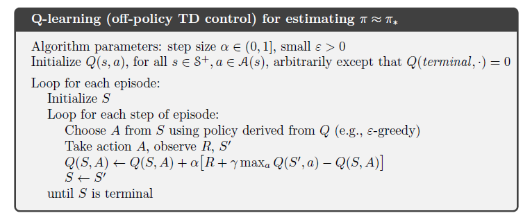
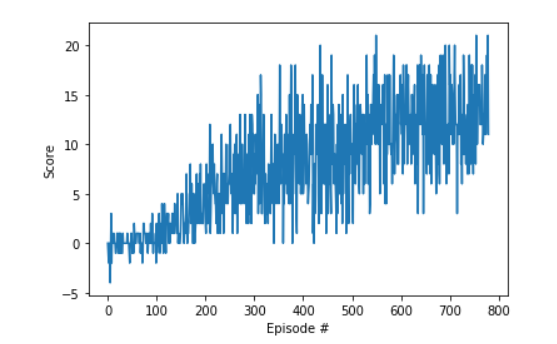

# Project 1: Navigation
[image1]: https://user-images.githubusercontent.com/10624937/42135619-d90f2f28-7d12-11e8-8823-82b970a54d7e.gif "Trained Agent"

## Introduction

The aim of this project is to train an agent to navigate in the given environment to collect yellow bananas and avoid purple bananas.

*Figure 1: Interaction of a Trained Agent*

A reward of +1 is provided for collecting a yellow banana, and a reward of -1 is provided for collecting a blue banana.  Thus, the goal of your agent is to collect as many yellow bananas as possible while avoiding blue bananas.  

The state space has 37 dimensions and contains the agent's velocity, along with ray-based perception of objects around agent's forward direction.  Given this information, the agent has to learn how to best select actions. 
Four discrete actions are available, corresponding to:

- **`0`** - move forward.
- **`1`** - move backward.
- **`2`** - turn left.
- **`3`** - turn right.

The task is episodic, and in order to solve the environment, your agent must get an average score of +13 over 100 consecutive episodes.
## Algorithm
### Markov Decision Process

This project uses a Deep Q Network algorithm which is based on Q-learning. Reinforcement learning algorithms such Q learning interacts with the environment and learns from the experience instead of labeled data unlike supervised learning. In reinforcement learning methods the algorithm is called an agent. The agent interacts with the environment through actions taken based on observations, which are called states. And the environment provides the agent a feedback through rewards. The agent learns the task by aiming to maximize the rewards. The task can be either episodic for example navigating a robot from point A to point B or the task can be continuous for example balancing an inverted pendulum. A reinforcement learning problem can be defined by a (finite) Markov Decision Problem(MDP). A finite MDP has a discrete/finite set of states,actions and rewards. An important property of an MDP is that the state of the environment in the future time steps depend only on the current state and the current not on the history of states. The following figure shows the interaction between an agent and the environment in an MDP.

*Figure 2: Agent-Environment interaction(source: Reinforcement Learning Richard R.Sutton and Andrew G.Barto)*

The agent and environment interaction in discrete time steps t= 1,2,3,... in each step the agent receives the state St and takes an action At and the environment provides the agent with new reward Rt+1 and St+1 and process continues in the sequence s0,a0,r1,s1,a1,r2,s2,a2.....   

Another property of MDP is that the current state and action does not determine only the immediate reward but also the future rewards. The agent learns the task by trying to maximize the cumulative rewards in the long run. Since agent cannot influence the past the agent can maximize it cumulative rewards in the future time steps by taking actions which will seek maximum rewards in the future time steps. The discounted cumulative rewards(Gt) at a time step t can be given by

Gt = Rt+1 + &gamma;Rt+2+&gamma;2Rt+3.... = &Sigma;&infin;k=0&gamma;kRt+k+1

(source: Reinforcement Learning Richard R.Sutton and Andrew G.Barto)

Here &gamma; is called as the discount factor and it chosen between 0 and 1. The value of &gamma; makes the agent to choose between immediate rewards(close to zero) and long term rewards(close to 1).

In reinforcement learning problem policy function &pi; determines the action at which has to be taken by the agent when the environment is in st. Value function v is the estimate how good it is for the agent to be in a given state. The state-value function of a state s for a given policy &pi; is denoted as v&pi;(s) is the expected return of rewards when the agent starts at the state s and takes actions based on policy &pi; thereafter. 

v&pi;(s) = E&pi;[Gt|St=s] = E&pi;[&Sigma;&infin;k=0&gamma;kRt+k+1|St=s]

(source: Reinforcement Learning Richard R.Sutton and Andrew G.Barto)

Similarly, we define the value of taking action a in state s under a policy &pi;, denoted q&pi;(s, a), as the expected return starting from s, taking the action a, and thereafter
following policy &pi;

q&pi;(s,a) = E&pi;[Gt|St=s,At=a] = E&pi;[&Sigma;&infin;k=0&gamma;kRt+k+1|St=s,At=a]

(source: Reinforcement Learning Richard R.Sutton and Andrew G.Barto)

The function q&pi; is called the action value function.

The aim of reinforcement learning problem is to find a policy function &pi; which maximizes the returns in long run. This policy is called as the optimal policy &pi;* which has expected returns greater than or equal to all other policies. The value function associated with this policy is called as the optimal value function v*(s) similarly the action value function associated with optimal policy is called as optimal action value function q*(s,a).

v*(s) = max v&pi;(s)

q*(s,a) = max q&pi;(s,a)

(source: Reinforcement Learning Richard R.Sutton and Andrew G.Barto)

### Q Learning 

Q-Learning is a method of estimating action value function and optimal policy. In Q-learning the state value function is stored in a table where the rows and columns represent the states and actions. The value inside the table are the cumulative rewards if the agent starts in a particular state s and takes action a and follows a policy &pi;. Initially the agent does has only initialized values in the q-table and takes only random actions but through interactions with the environment the values in the q-table are filled and the policy gets better. But there is a small problem here the values inside the q-table are the expected cumulative reward which can be obtained only after the end of an episode.It would be better to update the q-table at every time step in order estimate expected cumulative reward bellman equation for value function is used which is given below.

v&pi;(s) = E[Gt|St = s] = E[rt+&gamma;Gt+1|St = s]

similarly the action value function is given by

q&pi;(s,a) =  E[Gt|St = s,At=a] = E[rt+&gamma;Gt+1|St = s,At=a]

From the bellman equation the cumulative reward for given state and action at time step t is the sum of the reward at time t+1 and the discounted cumulative reward at the next state. Using this equation recursively the q-table can be filled at every time step with the interaction between the agent and the environment.  

 

*Figure 3: q-Learning pseudo code (source: Reinforcement Learning Richard R.Sutton and Andrew G.Barto)*

The above figure shows the pseudo code of the q-learning algorithm. During each step in the episode in q-learning algorithm mainly two things are done. An action is chosen based on a policy derived from existing q-table. The second thing is updating of the q-table. Generally &epsilon;-greedy policy is used in the q-learning which is also used in this project. In &epsilon;-greedy policy an action with maximum cumulative reward is chose with a probability of (1-&epsilon;) for the remaining probability &epsilon; any random action is chosen. The &epsilon;-greedy policy makes the algorithm to explore instead of reaching convergence at a local maximum. Here the factor &epsilon; is a hyperparameter which is chose a high value closer to 1 in the beginning where the agent has no experience and in later stages of the learning a low &epsilon; value is chosen in order to exploit on the learned policy. The idea of update step of the Q-table is to take average of expected reward for the given state and action over all experience observed where the expected cumulative reward is calculated using the bellman equation. The term R + &gamma;maxaQ(S',a) is the cumulative rewards for the next state and action containing max Q value for the next state. The term &alpha; in the update equation is hyperparameter which gives weight to difference between new Q value and existing Q values. 

### Deep Q Network Algorithm
The Deep Q Network (DQN) algorithm is based on the q-learning explained in the section before. The main difference is the use of a neural network to estimate the action-value function instead of a Q-table. The advantages using neural networks are they are very good non-linear function approximators and the use of neural network enables reinforcement learning to be applied in problems with large state-space which would otherwise be impossible. Neural networks were first successfully used to solve atari video games in the 2015 paper ["Human-level control through deep reinforcement learning"](http://www.davidqiu.com:8888/research/nature14236.pdf). The paper solved two major issues present in the use of neural networks in RL problems and it formed the basis of Deep Q Network . One is the violation of Markov process where an action taken in a state at a time step not only affects the next state but it also affects several sequential states. This avoided in the 2015 paper by using a circular buffer where each tuple of (state,action,reward,next state) are stored and a random batch is taken to train the neural network. Based on the q-learning algorithm action-value function is updated by minimizing the difference between value estimated using the current state-action pair and the estimated value of next state and greedy action.The use of same neural network is used to estimate the state-action value for current state and the next state in the parameter update step would make the algorithm unstable and diverge. To solve this the DQN algorithm uses two identical neural network on for estimating the value function of the current reward which is called current network and another the for estimating the value of next step which is called the target network. Only the current network is trained using gradient descent and the parameter values of the current network is copied to the target network based on the update equation after a  certain specified time steps which is a hyperparameter. 

In this project a neural network containing three fully connected layers are used to to map between the state vector of size 37 which is the input and the action vector of size 4 which is the ouput vector. The intermediate layer have an output size of 64 each. And the first two fully connected layers are followed by RELU activation functions to add non-linearity. 

Apart from the standard DQN architecture a Double Deep Q Network (DDQN) architecture discussed  in the paper [Deep Reinforcement learning using Double ](https://arxiv.org/abs/1509.06461) is used in this project. This significantly improves the learning time of agent for solving the environment from 1700 episodes to 680 episodes with DDQN architecture.    

## Results and Future Plans

The following figure shows the plot of rewards for each episodes.The DDQN algorithm used in this project is able to quickly solve the environment in 680 episodes.

*Figure 4: Plot of Rewards*

There are several other methods discussed on improving the DQN algorithm which are 
	
	- Prioritized Experience Replay
	- Dueling DQN  
	- Multi-step bootstrap targets
	- Noisy DQN
	- Distributional DQN
	- Rainbow (combination of all methods)

These methods can be implemented in future work to study the impact on the learning process.  