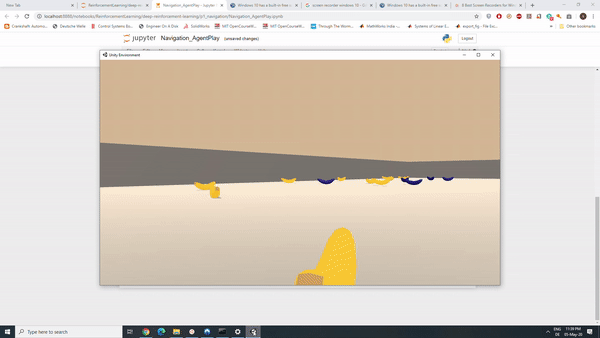
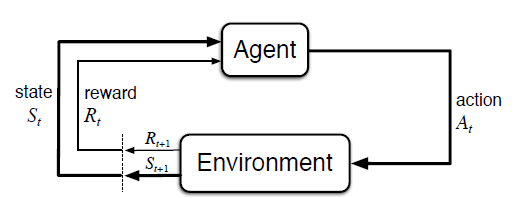

# Project 1: Navigation
[image1]: https://user-images.githubusercontent.com/10624937/42135619-d90f2f28-7d12-11e8-8823-82b970a54d7e.gif "Trained Agent"

## Introduction

The aim of this project is to train an agent to navigate in the given environment to collect yellow bananas and avoid purple bananas.

*Figure 1: Interaction of a Trained Agent*

A reward of +1 is provided for collecting a yellow banana, and a reward of -1 is provided for collecting a blue banana.  Thus, the goal of your agent is to collect as many yellow bananas as possible while avoiding blue bananas.  

The state space has 37 dimensions and contains the agent's velocity, along with ray-based perception of objects around agent's forward direction.  Given this information, the agent has to learn how to best select actions. 
Four discrete actions are available, corresponding to:

- **`0`** - move forward.
- **`1`** - move backward.
- **`2`** - turn left.
- **`3`** - turn right.

The task is episodic, and in order to solve the environment, your agent must get an average score of +13 over 100 consecutive episodes.
## Algorithm
### Markov Decision Process

This project uses a Deep Q Network algorithm which is based on Q-learning. Reinforcement learning algorithms such Q learning interacts with the environment and learns from the experience instead of labeled data unlike supervised learning. In reinforcement learning methods the algorithm is called an agent. The agent interacts with the environment through actions taken based on observations, which are called states. And the environment provides the agent a feedback through rewards. The agent learns the task by aiming to maximize the rewards. The task can be either episodic for example navigating a robot from point A to point B or the task can be continuous for example balancing an inverted pendulum. A reinforcement learning problem can be defined by a (finite) Markov Decision Problem(MDP). A finite MDP has a discrete/finite set of states,actions and rewards. An important property of an MDP is that the state of the environment in the future time steps depend only on the current state and the current not on the history of states. The following figure shows the interaction between an agent and the environment in an MDP.

Figure 2: Agent-Environment interaction(source: Reinforcement Learning Richard R.Sutton and Andrew G.Barto)

The agent and environment interaction in discrete time steps t= 1,2,3,... in each step the agent receives the state St and takes an action At and the environment provides the agent with new reward Rt+1 and St+1 and process continues in the sequence s0,a0,r1,s1,a1,r2,s2,a2.....   

Another property of MDP is that the current state and action does not determine only the immediate reward but also the future rewards. The agent learns the task by trying to maximize the cumulative rewards in the long run. Since agent cannot influence the past the agent can maximize it cumulative rewards in the future time steps by taking actions which will seek maximum rewards in the future time steps. The discounted cumulative rewards(Gt) at a time step t can be given by

Gt = Rt+1 + &gamma;Rt+2+&gamma;2Rt+3.... = &Sigma;&infin;k=0&gamma;kRt+k+1

(source: Reinforcement Learning Richard R.Sutton and Andrew G.Barto)

Here &gamma; is called as the discount factor and it chosen between 0 and 1. The value of &gamma; makes the agent to choose between immediate rewards(close to zero) and long term rewards(close to 1).

In reinforcement learning problem policy function &pi; determines the action at which has to be taken by the agent when the environment is in st. Value function v is the estimate how good it is for the agent to be in a given state. The state-value function of a state s for a given policy &pi; is denoted as v&pi;(s) is the expected return of rewards when the agent starts at the state s and takes actions based on policy &pi; thereafter. 

v&pi;(s) = E&pi;[Gt|St=s] = E&pi;[&Sigma;&infin;k=0&gamma;kRt+k+1|St=s]

(source: Reinforcement Learning Richard R.Sutton and Andrew G.Barto)

Similarly, we define the value of taking action a in state s under a policy &pi;, denoted q&pi;(s, a), as the expected return starting from s, taking the action a, and thereafter
following policy &pi;

q&pi;(s,a) = E&pi;[Gt|St=s,At=a] = E&pi;[&Sigma;&infin;k=0&gamma;kRt+k+1|St=s,At=a]

(source: Reinforcement Learning Richard R.Sutton and Andrew G.Barto)

The function q&pi; is called the action value function.

The aim of reinforcement learning problem is to find a policy function &pi; which maximizes the returns in long run. This policy is called as the optimal policy &pi;* which has expected returns greater than or equal to all other policies. The value function associated with this policy is called as the optimal value function v*(s) similarly the action value function associated with optimal policy is called as optimal action value function q*(s,a).

v*(s) = max v&pi;(s)

q*(s,a) = max q&pi;(s,a)

(source: Reinforcement Learning Richard R.Sutton and Andrew G.Barto)

### Q Learning and Deep Q Network Algorithm
### Double Q Network
## Results and Conclusion
